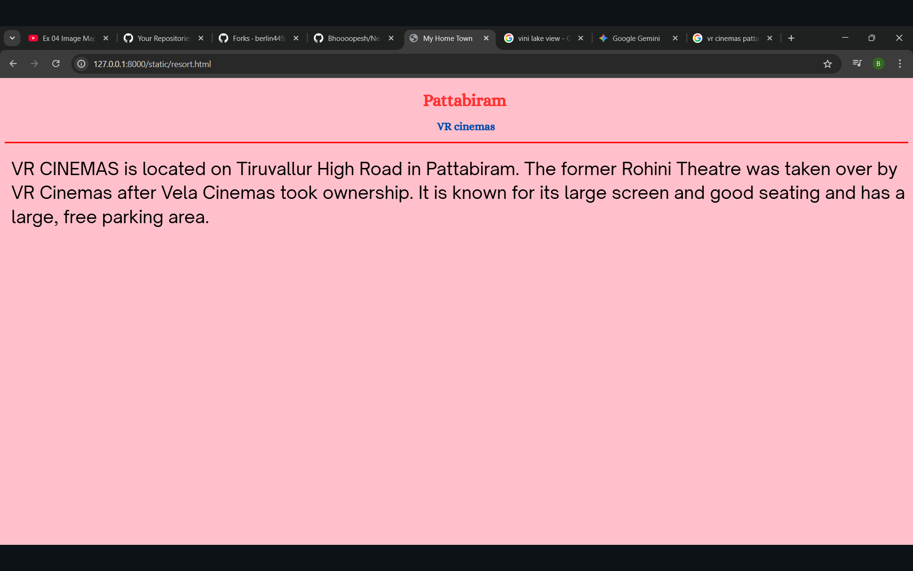

# Ex04 Places Around Me

## AIM
To develop a website to display details about the places around my house.

## DESIGN STEPS

### STEP 1
Create a Django admin interface.

### STEP 2
Download your city map from Google.

### STEP 3
Using ```<map>``` tag name the map.

### STEP 4
Create clickable regions in the image using ```<area>``` tag.

### STEP 5
Write HTML programs for all the regions identified.

### STEP 6
Execute the programs and publish them.

## CODE
```
map.html

<html>
<head>
<title>My City</title>
</head>
<body>
<h1 align="center">
<font color="red"><b>Pattabiram</b></font>
</h1>
<h3 align="center">
<font color="blue"><b>Bhoopesh P(212224110013)</b></font>
</h3>
<center>

<map name="MyCity">
<area shape="rect" coords="700,250,850,400" href="home.html" title="My Home Town">

<area shape="circle" coords="700,850,400" href="resort.html" title="Vini lake view">

<area shape="circle" coords="780,330,40" href="movie.html" title="VR Cinemas">

</map>
</center>
</body>
</html>


movie.html


<html>
<head>
<title>My Home Town</title>
</head>
<body bgcolor="pink">
<h1 align="center">
<font color="red"><b>Pattabiram</b></font>
</h1>
<h3 align="center">
<font color="blue"><b><strong>VR cinemas</strong></b></font>
</h3>
<hr size="3" color="red">
<align="justify">
<font face="Georgia" size="6">
VR CINEMAS is located on Tiruvallur High Road in Pattabiram. 
The former Rohini Theatre was taken over by VR Cinemas after 
Vela Cinemas took ownership. 
It is known for its large screen and good seating and has a large, 
free parking area. 
</font>

</body>
</html>


resort.html

<html>
<head>
<title>My Home Town</title>
</head>
<body bgcolor="pink">
<h1 align="center">
<font color="red"><b>Pattabiram</b></font>
</h1>
<h3 align="center">
<font color="blue"><b><strong>Vini Lake view</strong></b></font>
</h3>
<hr size="3" color="red">
<align="justify">
<font face="Georgia" size="6">
Vini Lake View is a luxury 3-bedroom villa located in Nemilicheri, Chennai, 
near Pattabiram. It is not a public restaurant, but a private holiday rental property 
with an in-house kitchen and a pool. The property is noted for its scenic location 
and a peaceful, nature-filled vibe, making it a "big YES" for a calm weekend getaway. 
</font>

</body>
</html>
```


## OUTPUT





## RESULT
The program for implementing image maps using HTML is executed successfully.
